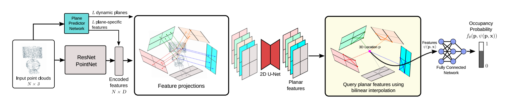

# Dynamic Plane Convolutional Occupancy Networks
[**Paper**](https://arxiv.org/abs/2011.05813) | [**Supplementary**](https://polybox.ethz.ch/index.php/s/ehK175BH7oVYnxy#pdfviewer) | [**Video**](https://screencast-o-matic.com/watch/cYXOcaLKJz)



This repository contains the implementation of the paper:

Dynamic Plane Convolutional Occupancy Networks  
[Stefan Lionar*](https://github.com/splionar), [Daniil Emtsev*](https://github.com/daniil-777), [Dusan Svilarkovic*](https://github.com/dsvilarkovic), and [Songyou Peng](https://pengsongyou.github.io/)  
**WACV 2021**  

If you find our code or paper useful, please consider citing us:

```bibtex
@inproceedings{Lionar2021WACV,
 title = {Dynamic Plane Convolutional Occupancy Networks},
 author={Stefan Lionar and Daniil Emtsev and Dusan Svilarkovic and Songyou Peng},
 booktitle = {Winter Conference on Applications of Computer Vision (WACV)},
 year = {2021}}
```

## Installation
First you have to make sure that you have all dependencies in place.
The simplest way to do so, is to use [anaconda](https://www.anaconda.com/). 

You can create an anaconda environment called `dyn_conv_onet` using
```
conda env create -f environment.yaml
conda activate dyn_conv_onet
```
**Note**: if the `pytorch_scatter` is not working, you can install it following [the official instruction](https://github.com/rusty1s/pytorch_scatter#pytorch-140).
```
pip install torch-scatter==latest+cu101 -f https://pytorch-geometric.com/whl/torch-1.4.0.html
```

Next, compile the extension modules.
You can do this via
```
python setup.py build_ext --inplace
```
 
## Dataset

To evaluate a pretrained model or train a new model from scratch, you have to obtain the respective dataset.
In this paper, we consider the ShapeNet and synthetic room dataset:

### ShapeNet
You can download the dataset (73.4 GB) by running the [script](https://github.com/autonomousvision/occupancy_networks#preprocessed-data) from Occupancy Networks. After, you should have the dataset in `data/ShapeNet` folder.
Or by calling the command 
```
bash scripts/download_shape_net_data.sh
```
### Synthetic room 
You can download the synthetic room dataset by calling the command
```
bash scripts/download_room_data.sh
```
If you use this dataset, please cite [Convolutional Occupancy Networks](https://pengsongyou.github.io/conv_onet) paper.

## Usage
When you have installed all binary dependencies and obtained the preprocessed data, you are ready to run our pre-trained models and train new models from scratch.

### Mesh Generation
To generate meshes using a trained model, use
```
python generate.py CONFIG.yaml
```
where you replace `CONFIG.yaml` with the correct config file. Our configurations can be found in configs folder.

**Use a pre-trained model**  
The easiest way is to use a pre-trained model. You can do this by using one of the config files under the `pointcloud` folder and downloading pretrained models from this [link](https://polybox.ethz.ch/index.php/s/ehK175BH7oVYnxy).

For example, for 3D reconstruction from noisy point cloud with our 3-plane model on the synthetic room dataset, you can simply run:
```
python generate.py configs/pointcloud/shapenet/shapenet_dynamic_3plane.yaml
```
The script will run the generation of meshes from the pretrained model. You can find the outputs in the `out/...` folders


 
### Evaluation
For evaluation of the models, we provide the script `eval_meshes.py`. You can run it using:
```
python eval_meshes.py CONFIG.yaml
```
The script takes the meshes generated in the previous step and evaluates them using a standardized protocol. The output will be written to `.pkl/.csv` files in the corresponding generation folder which can be processed using [pandas](https://pandas.pydata.org/).

### Training
Finally, to train a new network from scratch, run:
```
python train.py CONFIG.yaml
```
For available training options, please take a look at `configs/default.yaml` and `configs/pointcloud/shapenet_dynamic_3plane.yaml`.

### Configuration file setup for training
This part will explain how to modify `configs/pointcloud/shapenet_dynamic_3plane.yaml` to run according to your wishes.

#### **Loss Similarity**

To run with similarity loss you should put the `training.similarity = True` On the opposite, put it to `False`

#### **Models**

* To use a **Dynamic Plane** model set `dynamic_pointnet_local_pool: True` in `model.encoder` and `dynamic_simple_local:True` in `model.decoder`

* To use a **Hybrid Dynamic Plane** model set `hybrid_pointnet_local_pool: True` in `model.encoder` and `hybrid_simple_local: True` in `model.decoder`

* To change number of planes predicted, put number of channels you need on argument `model.encoder_kwargs.n_channels`
* To set up pretrained model to run,  change `training.out_dir` to file path of the model (in `train.py` we use `model.pt` as the pretrained file name).


#### **Positional Encoding**

To enable the positional encoding put `model.encoder_kwargs.pos_encoding=True` and `model.decoder_kwargs.pos_encoding=True`. 


### **Rotation augmentation**
To train a new network with random rotations on input, run:
```
python train_rotate.py CONFIG.yaml
```
### Using `generate_rotation.py` for rotated objects

Before calling `generate_rotation.py`, it is mandatory and convenient to make your own config file and run it when calling for both `generate.py` and `eval_meshes.py`.
Example for your file should look like this:

```
inherit_from: configs/pointcloud/shapenet_dynamic_3plane.yaml
test:
  model_file: <.pt model file path>
model : 
  encoder_kwargs:
    hidden_dim: 32
    n_channels: 7
generation:
  generation_dir: generation_7plane_45_degrees
degrees: 45
```

Where you explicitly define `model.encoder_kwargs.n_channels` for number of planes, `generation.generation_dir` for specifying the name of the folder you want to save your reconstructions too (in this case, models will be saved in `out/pointcloud/dpoc/generation_7plane_45_degrees`), and `degrees` for rotation range you wish to include. Of course `test.model_file` path also needs to be changed in order if you want to generate with your own model.

Finally, call:

`python generate_rotation.py configs/pointcloud/CONFIG_NAME.yaml --no-cuda`

### Using `eval_meshes.py` for rotation evaluating
For evaluating generated object, you have to option:
* reconstructed rotated object vs rotated object
* reconstructed rotated object vs non-rotated object

**reconstructed rotated object vs rotated object** [recommended]

In this case, call:

`python eval_meshes.py configs/pointcloud/CONFIG_NAME.yaml --no-cuda --eval-rotations`


**reconstructed rotated object vs non-rotated object** 

In this case, call: 

`python eval_meshes.py configs/pointcloud/CONFIG_NAME.yaml --no-cuda`


## Acknowledgement
The code is inherited from the official repository of [Convolutional Occupancy Networks](https://github.com/autonomousvision/convolutional_occupancy_networks).
